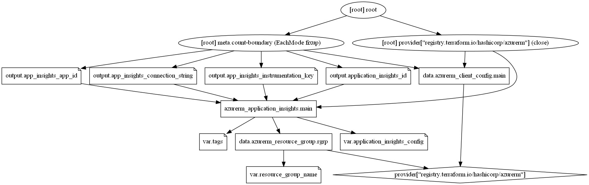

# Azure Application Insights Terraform module

Application Insights, a feature of Azure Monitor, is an extensible Application Performance Management (APM) service for developers and DevOps professionals. Use it to monitor your live applications. It will automatically detect performance anomalies, and includes powerful analytics tools to help you diagnose issues. This terraform module quickly creates.

## Module Usage

```terraform
# Azurerm Provider configuration
provider "azurerm" {
  features {}
}

module "application-insights" {
  source  = "kumarvna/application-insights/azurerm"
  version = "1.0.0"

  # By default, this module will not create a resource group. Location will be same as existing RG.
  # proivde a name to use an existing resource group, specify the existing resource group name, 
  resource_group_name = "rg-shared-westeurope-01"

  application_insights_config = {
    mydemoappinsightworkspace = {
      application_type = "web"
    }
  }
}
```

## **`application_insights_config`** - Application Insights Settings

`application_insights_config` block helps you setup the application environment and accept following Keys

| Name | Description
|--|--
`name`|Specifies the name of the Application Insights component
`application_type`|Specifies the type of Application Insights to create. Valid values are `ios` for iOS, `java` for Java web, `MobileCenter` for App Center, `Node.JS` for Node.js, `other` for General, `phone` for Windows Phone, `store` for Windows Store and `web` for ASP.NET. Please note these values are case sensitive; unmatched values are treated as ASP.NET by Azure. Changing this forces a new resource to be created.
`daily_data_cap_in_gb`|Specifies the Application Insights component daily data volume cap in GB.
`daily_data_cap_notifications_disabled`|Specifies if a notification email will be send when the daily data volume cap is met. Defaults to `false`
`retention_in_days`|Specifies the retention period in days. Possible values are `30`, `60`, `90`, `120`, `180`, `270`, `365`, `550` or `730`. Defaults to `90`.
`sampling_percentage`|Specifies the percentage of the data produced by the monitored application that is sampled for Application Insights telemetry. Defaults to `100`.
`disable_ip_masking`|By default the real client ip is masked as `0.0.0.0` in the logs. Use this argument to disable masking and log the real client ip. Defaults to `false`.

## Recommended naming and tagging conventions

Applying tags to your Azure resources, resource groups, and subscriptions to logically organize them into a taxonomy. Each tag consists of a name and a value pair. For example, you can apply the name `Environment` and the value `Production` to all the resources in production.
For recommendations on how to implement a tagging strategy, see Resource naming and tagging decision guide.

> [IMPORTANT]
> Tag names are case-insensitive for operations. A tag with a tag name, regardless of the casing, is updated or retrieved. However, the resource provider might keep the casing you provide for the tag name. You'll see that casing in cost reports. **Tag values are case-sensitive.**
>

An effective naming convention assembles resource names by using important resource information as parts of a resource's name. For example, using these [recommended naming conventions](https://docs.microsoft.com/en-us/azure/cloud-adoption-framework/ready/azure-best-practices/naming-and-tagging#example-names), a public IP resource for a production SharePoint workload is named like this: `pip-sharepoint-prod-westus-001`.

## Requirements

| Name | Version |
|------|---------|
| terraform | >= 0.13 |
| azurerm | >= 2.59.0 |

## Providers

| Name | Version |
|------|---------|
| azurerm | >= 2.59.0 |

## Inputs

| Name | Description | Type | Default |
|--|--|--|--|
`create_resource_group` | Whether to create resource group and use it for all networking resources | string | `"false"`
`application_insights_config`|Manages an Application Insights component|object|`{}`
`tags`|A map of tags to add to all resources|map|`{}`

## Outputs

| Name | Description |
|--|--|
`application_insights_id`|The ID of the Application Insights component
`app_insights_app_id`|The App ID associated with this Application Insights component
`app_insights_instrumentation_key`|The Instrumentation Key for this Application Insights component
`app_insights_connection_string`|The Connection String for this Application Insights component

## Resource Graph



## Authors

Originally created by [Kumaraswamy Vithanala](mailto:kumarvna@gmail.com)

## Other resources

- [Application Insights)](https://docs.microsoft.com/en-us/azure/azure-monitor/app/app-insights-overview)
- [Terraform AzureRM Provider Documentation](https://www.terraform.io/docs/providers/azurerm/index.html)